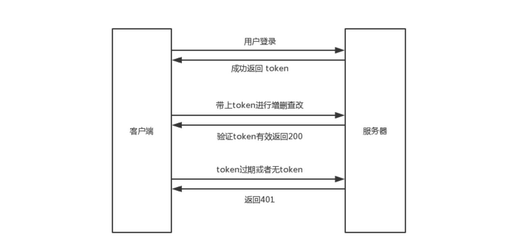

Koa2使用jwt进行鉴权及路由权限分发
===

参考：

[https://github.com/lin-xin/blog/issues/28](https://github.com/lin-xin/blog/issues/28)

[https://www.cnblogs.com/zhangnan35/p/11217962.html](https://www.cnblogs.com/zhangnan35/p/11217962.html)

### 为什么要使用jwt？

> 后端书写REST api时，有一些api是非常敏感的，比如获取用户个人信息，查看所有用户列表，修改密码等。如果不对这些api进行保护，那么别人就可以很容易地获取并调用这些 api 进行操作。

jwt就是用于操作者在调用一些api接口之前，服务端对操作者进行身份认证，即所谓的鉴权。

jwt是Json Web Token的简称，它定义了一种通信双方之间以 JSON 对象的形式安全传递信息的方法。
JWT 可以使用 HMAC 算法或者是 RSA 的公钥密钥对进行签名，复杂度较高，换来的是更可靠的安全系数。

[Koa2使用jwt进行鉴权及路由权限分发](./koa2/ko2_jwt.md)
